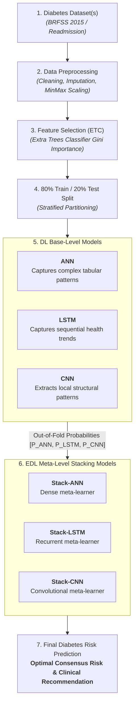

# Diabetes Ensemble Deep Learning (EDL) Clinical Decision Support System

An interactive clinical decision support web application replicating the proposed system from:
> **M. S. Al Reshan et al.**, *"An Innovative Ensemble Deep Learning Clinical Decision Support System for Diabetes Prediction,"* **IEEE Access**, vol. 12, 2024.

---

## 🏛️ Proposed System Architecture



---

## 🌟 Key Features

1. **Dual Dataset & Clinical Targets**:
   - **BRFSS 2015 Diabetes Health Indicators**: 3-Class Risk (`No Diabetes`, `Prediabetes`, `Diabetes`).
   - **Diabetic Patient Hospital Readmission**: Binary 30-Day Risk (`Not Readmitted <30d`, `Readmitted <30d`).

2. **Full Multi-Model Deep Learning Stacking**:
   - **Tier 1 Base Models**: Real Keras Neural Network (`ANN`), 1D Convolutional Network (`CNN`), and Recurrent Network (`LSTM`).
   - **Tier 2 Meta Stacking**: Keras `Stack-ANN`, `Stack-LSTM`, `Stack-CNN`, plus a **Consensus Ensemble (All 3)**.

3. **Interactive Streamlit Web Application**:
   - **Real-Time Patient Predictor**: Quick-fill presets (*Healthy Young Adult*, *Pre-Diabetic*, *High Risk*), dynamic BMI indicator, risk category banners (Green / Amber / Red).
   - **Comparative Agreement**: Base Models (ANN, LSTM, CNN) vs. Meta Stacking Models (Stack-ANN, Stack-LSTM, Stack-CNN) breakdown and interactive Plotly charts.
   - **Performance Benchmarks**: Evaluates all 7 metrics from the paper: Accuracy, Precision, Sensitivity, Specificity, F1-Score, MCC, and ROC-AUC.
   - **Feature Selection Breakdown**: Extra Trees Classifier (ETC) Gini importance bar chart.
   - **Batch Screening**: Upload cohort CSV files for automated screening and export predictions.
   - **System Architecture Flowchart**: Visual interactive flow matching the proposed system diagram.

---

## 📊 Held-Out Test Set Performance (BRFSS 2015)

| Tier | Model | Accuracy | Precision | Sensitivity | Specificity | F1-Score | MCC | ROC-AUC |
| :--- | :--- | :---: | :---: | :---: | :---: | :---: | :---: | :---: |
| **Base** | ANN | 75.43% | 0.4236 | 0.4859 | 0.8104 | 0.4371 | 0.3496 | 0.7510 |
| **Base** | LSTM | 75.92% | 0.4137 | 0.4585 | 0.7840 | 0.4270 | 0.3000 | 0.7273 |
| **Base** | CNN | 75.54% | 0.4202 | 0.4770 | 0.8023 | 0.4338 | 0.3339 | 0.7513 |
| **Meta** | **Stack-ANN** | **76.45%** | **0.4258** | **0.4835** | **0.8082** | **0.4407** | **0.3511** | **0.7563** |
| **Meta** | **Stack-LSTM** | 75.85% | 0.4240 | 0.4838 | 0.8083 | 0.4382 | 0.3480 | 0.7534 |
| **Meta** | **Stack-CNN** | 76.27% | 0.4254 | 0.4842 | 0.8092 | 0.4401 | 0.3516 | 0.7518 |
| **Meta** | **Consensus Ensemble** | 76.18% | 0.4252 | 0.4842 | 0.8089 | 0.4397 | 0.3509 | 0.7545 |

---

## 🚀 How to Run

1. **Clone the repository:**
   ```bash
   git clone https://github.com/Vetri-P/<repository-name>.git
   cd <repository-name>
   ```

2. **Install requirements:**
   ```bash
   pip install -r requirements.txt
   ```

3. **Launch the Streamlit app:**
   ```bash
   streamlit run app.py
   ```
   Open your browser at `http://localhost:8501`.

---

## 📚 Reference

```bibtex
@article{alreshan2024innovative,
  title={An Innovative Ensemble Deep Learning Clinical Decision Support System for Diabetes Prediction},
  author={Al Reshan, M. S. and others},
  journal={IEEE Access},
  volume={12},
  year={2024},
  publisher={IEEE}
}
```
